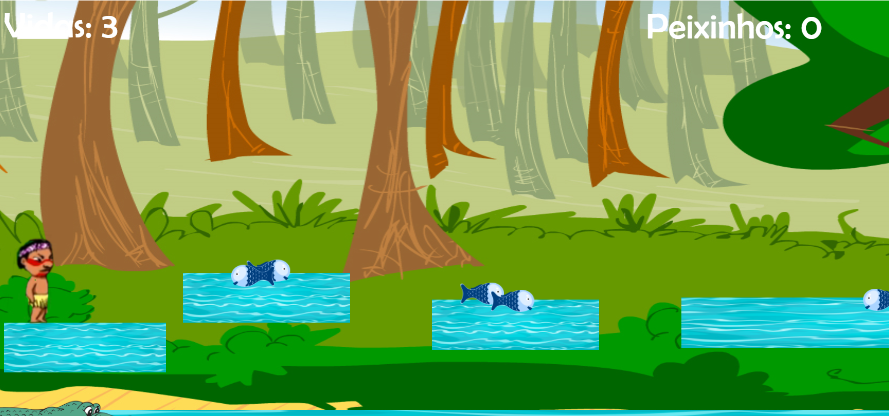

# _Bem-vindo ao meu Portfólio_

# _Um pouco sobre mim..._ 
# 

_Meu nome é Joziele Santos, tenho 19 anos e estudo no IFRN Campus Ceará-Mirim, onde estou cursando Programação de Jogos Digitais._   

# _Redes sociais_

* _Facebook: [Jozielle Santos](https://www.facebook.com/jozielle.santos.378)_
* _Instagram: [jozielles](https://www.instagram.com/jozielles/)_
* _E-mail: joziele.santos98@gmail.com_

* * * 

# _Games_

#   

* _Descrição: O jogo Cacique tem como objetivo fazer o personagem chegar ao final da segunda fase para conquistar a índia e, para isso, ele precisará coletar comidas sem perder as vidas disponíveis em cada fase._ 

# 

* _Descrição: O Domination é um jogo de ação dividido em fases que se faz necessário passar obstaculos ocultos, barra de vida e que ao ser tocada reinicia todo o jogo._ 

* * * 

# _Artes_
#   

#     

* * * 

# _Influence Map_

#   

* _Descrição: Influence Map são imagens que servem de inspiração para criação de nossas proiprias artes._

* * * 

# _Projetos_  
# _TPM_
* _Objetivo:Investigar a prevalência da TPM entre um grupo de mulheres da cidade de Ceará-Mirim e criar um website que possa ser veículo de informação sobre o tema._

* _Proj. Música_
* _Proj. jogos_

* * *

