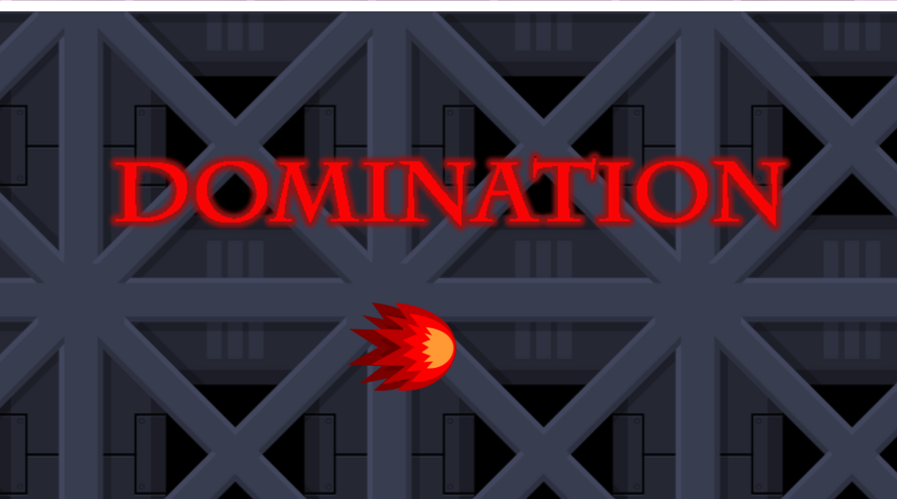

# _Bem-vindo ao meu Portfólio_

# _Um pouco sobre mim..._ 
# 

_Meu nome é Joziele Santos, tenho 19 anos e estudo no IFRN Campus Ceará-Mirim, onde estou cursando Programação de Jogos Digitais._   

# _Redes sociais_

* _Facebook: [Jozielle Santos](https://www.facebook.com/jozielle.santos.378)_
* _Instagram: [jozielles](https://www.instagram.com/jozielles/)_
* _E-mail: joziele.santos98@gmail.com_

* * * 

# Logo da Empresa

# 

# _Games_

#   

* _Descrição: O jogo Cacique tem como objetivo fazer o personagem chegar ao final da segunda fase para conquistar a índia e, para isso, ele precisará coletar comidas sem perder as vidas disponíveis em cada fase._ 

# 

* _Descrição: O Domination é um jogo de ação dividido em fases que é necessário passar obstaculos ocultos, barra de vida e que ao ser tocada reinicia todo o jogo._ 

* * * 

# _Animaçães_

# 

# 

* * *

# _Artes_

# Jogo: _Cacique_

# 

# 

# 

# Jogo: _Domination_

# 

# 

* * * 

# _Influence Map_

#   

* _Descrição: Influence Map são imagens que servem de inspiração para a criação de nossas proiprias artes._

* * * 

# _Projetos_  
# _TPM_
* _**Objetivo:** Investigar como ocorre a TPM em um grupo de mulheres na cidade de Ceará-Mirim, e criar um website que possa servir como um canal de informação sobre o tema._

# _Música_
* _**Objetivo:** Descobrir pessoas que tenham aptidão na arte da dança, teatro e canto, sendo aprensentado um musical na própria instituição. Esse musical corresponde ao CIA Musical Tiê._

# 

# _Jogos_
* _**Objetivo:** Todo bimestre é dado um tema no qual é elaborado um jogo em cima do mesmo, e, este jogo, tem como intuito colocar em prática os conhecimentos obtidos nas matérias de Motores de Jogos II e Animação e Multímidia._

* * *

